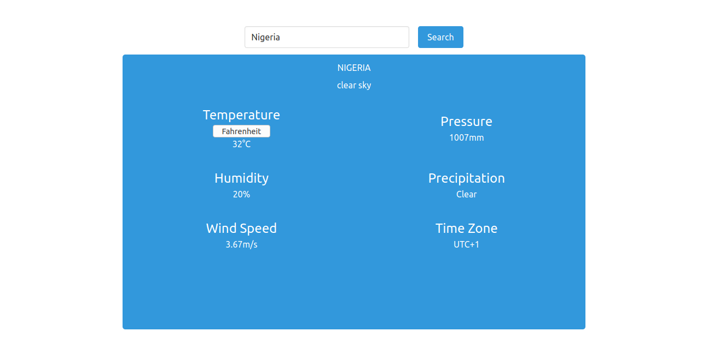

## Weather-forecast 
 
 

- Set up a blank HTML document with the appropriate links to your JavaScript and CSS files.
- Write the functions that hit the API. Wrote a functions that can take a location and return the weather data for that location. 
- Write the functions that process the JSON data you’re getting from the API and return an object with only the data you require for your app.
- Set up a simple form that will let users input their location and will fetch the weather info  
- Display the information on your webpage!

## Built With

- HTML
- Scss
- Javascript(ES6)
- Webpack4
- Bulma.io

## Live Demo

## Prerequisites
- You need to have node already installed with npm

## Getting Started

To get a local copy up and running follow these simple example steps.

### Setup

1.  Clone this repository with
   - <code> `git clone https://github.com/Haroonabdulrazaq/Weather-forecast.git` </code>
2.  Change to the project directory by entering
    - <code>`cd Weather-forecast` </code>
3. Open in Editor of choice

## Webpack Setup

npm install [To install all dependencies]
npm run build [To bundle the files]
npm run watch [To update as you make changes]

## Authors

👤 **Haroon Abdulrazaq**

- Github: [@haroonabdulrazaq](https://github.com/haroonabdulrazaq)
- Twitter: [@Hanq_o](https://twitter.com/Hanq_o)
- Linkedin: [Haroonabdulrazaq](https://www.linkedin.com/in/haroonabdulrazaq)

## Deployment
  Raw Githack

## 🤝 Contributing

Contributions, issues and feature requests are welcome!

Feel free to check the [issues page](issues/).

## Show your support

Give a ⭐️ if you like this project!

## Acknowledgments

- Microverse
- The Odin Project

## 📝 License

This project is [MIT](lic.url) licensed.